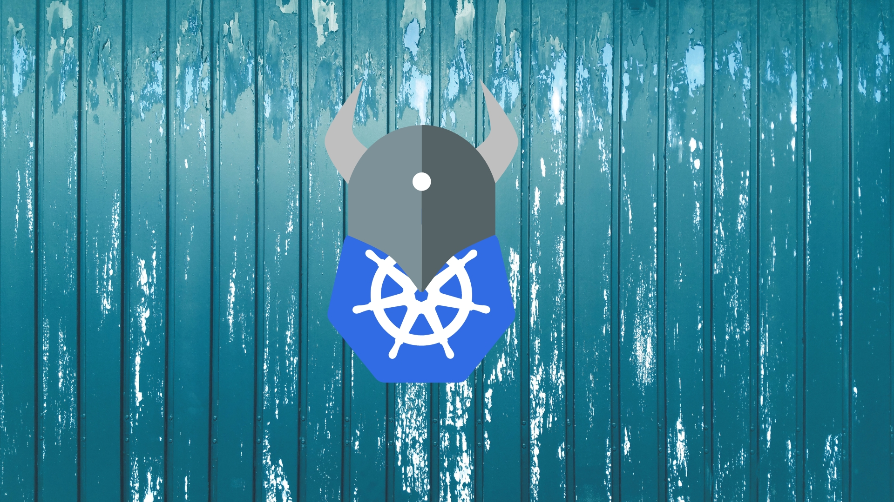

# Kubernetes OPA Gatekeeper Policy



This repository contains a solution using Open Policy Agent (OPA) Gatekeeper to enforce policies in a Kubernetes cluster, specifically restricting the use of the `latest` image tag in both Pods and Deployments.

## Setup Instructions

Follow these steps to create a Kubernetes cluster, install OPA Gatekeeper, and apply the policy:

### Step 1: Create a Kubernetes Cluster

```bash
kind create cluster --name opa-cluster
```

### Step 2: Install OPA gatekeeper
```bash
helm repo add gatekeeper https://open-policy-agent.github.io/gatekeeper/charts
helm repo update
helm install gatekeeper/gatekeeper --name-template=gatekeeper --namespace gatekeeper-system --create-namespace
```

### Step 3: Deploy the constraint template
```bash
kubectl apply -f constraint_template.yaml
```

### Step 4: Deploy a constraint
```bash
kubectl apply -f constraint.yaml
```

### Step 5: Try to deploy an nginx pod using the latest image
```bash
kubectl apply -f nginx.yaml
```
You should get this error:
    Error from server (Forbidden): error when creating "nginx.yaml": admission webhook "validation.gatekeeper.sh" denied the request: [no-latest-image-tag] container nginx is using the latest tag